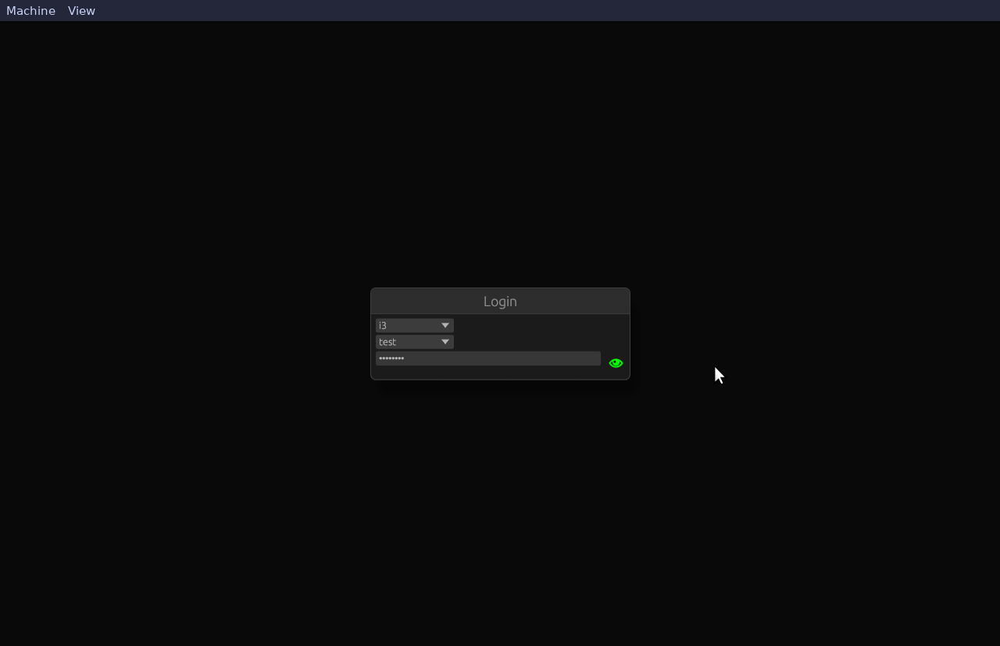
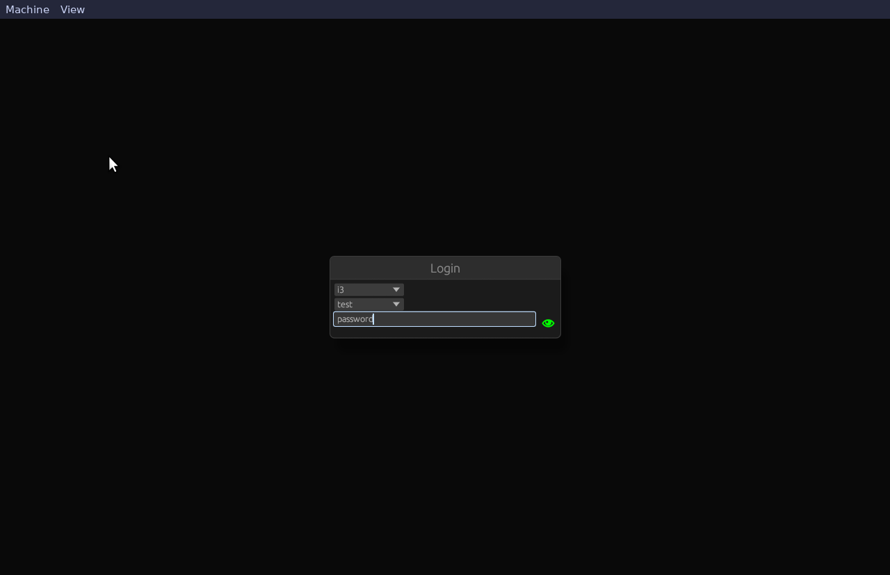
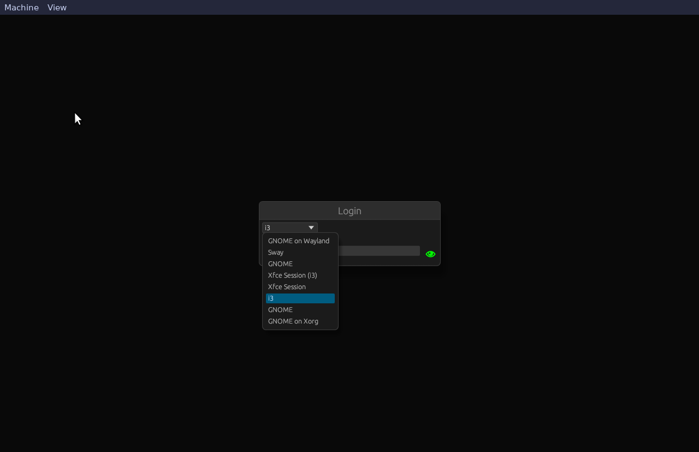

# MyDM

WIP 🏗️🚧 (launching the desktop doesn't work yet)

Simple display manager using wayland, rust and egui

## TODO

- nixos test in vm (wrong and correct password)
- support running dm using x11
- tests: run desktops: i3 (x11), sway (wayland), gnome? (x11 and wayland)
  - each using dm in wayland and x11 => 4*2 = 8 tests
- desktop entry choice
- auto login
- default session
- remember last session
- cargo features for x11 or wayland compatibilty (avoid building x11 packages
  for nothing)
